# Campfire-1 Sherlock Analysis Report

* **Date of Analysis:** September 15, 2025
* **Analyst:** Belhamici Abderrahmane
* **Source:** [HackTheBox Sherlock – *Campfire-1*](https://app.hackthebox.com/sherlocks/Campfire-1)
* **Dataset:** Windows Event Log files + Prefetch Files

---

## Terminology and Background

### Active Directory (AD)

**Active Directory** is a directory service developed by Microsoft for Windows domain networks. Think of it as a central database and phonebook for an organization's IT infrastructure. It stores information about all network resources as "objects," including **users**, **computers**, **groups**, and other services. AD provides a centralized platform for administrators to manage and secure network resources, enforcing security policies and controlling who has access to what.

### Domain Controller (DC)

A **Domain Controller (DC)** is a server that runs Active Directory Domain Services (AD DS). Its main job is to act as the "gatekeeper" for a network. It's responsible for **authentication** (verifying a user's identity) and **authorization** (determining what a user can access). Every time a user logs in or a service needs to authenticate, the request is sent to a DC, which checks the credentials against its database and issues tickets to grant access.

### Kerberos Protocol

**Kerberos** is the default authentication protocol used in Windows environments. It is a secure, ticket-based system designed to prevent passwords from being transmitted over the network. It relies on a trusted third party, the **Key Distribution Center (KDC)**, which is a service running on the DC. The protocol works by issuing encrypted "tickets" that prove a user's identity. When a user wants to access a service, they first get a **Ticket-Granting Ticket (TGT)** from the KDC. They then present this TGT to the KDC to get a **Service Ticket (ST)** for the specific service they want to use.

### The Kerberoasting Attack

**Kerberoasting** is a post-exploitation attack that targets the Kerberos protocol to obtain and crack service account passwords. The attack works by exploiting a key part of the Kerberos process: any authenticated domain user can request a service ticket for any service with a registered **Service Principal Name (SPN)**.

The attack follows these steps:
1. **SPN Enumeration:** The attacker, using a low-privileged account, queries Active Directory to find accounts with SPNs.
2. **Ticket Request:** The attacker requests a service ticket for a targeted SPN. The DC, without checking permissions, issues a ticket encrypted with the **service account's password hash**.
3. **Offline Cracking:** The attacker captures this ticket and takes it offline. They use password-cracking tools to brute-force the password hash to get the plaintext password.
4. **Privilege Escalation:** With the plaintext password, the attacker can impersonate the service account, which often has elevated privileges, allowing them to move laterally through the network and access sensitive systems.


### Technical Flow Diagram

The following diagram illustrates the relationship between legitimate Kerberos authentication and the Kerberoasting attack methodology:

<!--  -->

<p align="center">
  
</p>


## Overview
This analysis investigates a suspected Kerberoasting attack targeting the FORELA.LOCAL domain. The investigation examines security logs from the Domain Controller, PowerShell operational logs from the affected workstation, and prefetch files to reconstruct the complete attack chain from initial reconnaissance through credential harvesting.

## Investigation Details
- **Challenge**: Campfire-1 Sherlock
- **Analysis Tools**: Splunk, PECmd (Prefetch Parser)
- **Timeline**: May 21, 2024, 03:16:32 - 03:18:09
- **Duration**: ~1 minute 37 seconds
- **Target Domain**: FORELA.LOCAL
- **Compromised User**: alonzo.spire

---

## Evidence Sources

| File Type | File Name | Purpose | Analysis Focus |
|-----------|-----------|---------|----------------|
| **Security Event Log** | SECURITY-DC.evtx | Domain Controller security events | Kerberos ticket requests, authentication events |
| **PowerShell Event Log** | PowerShell-Operational.evtx | PowerShell script execution logs | Command execution, script block logging |
| **Prefetch Files** | Various .pf files | Application execution artifacts | Tool execution timeline and file paths |

---

## Windows Event IDs Reference

| Event ID | Event Type | Source Log | Description |
|----------|------------|------------|-------------|
| **4769** | Kerberos Service Ticket Request | Security | Logs requests for Kerberos service tickets from KDC |
| **4104** | PowerShell Script Block | PowerShell-Operational | Captures PowerShell commands and script execution |

---

## Task Analysis Summary

### Kerberos Attack Detection

#### Task 1: Attack Timeline Identification
- **Question**: Analyzing Domain Controller Security Logs, can you confirm the date & time when the kerberoasting activity occurred?
- **Answer**: 2024-05-21 03:18:09
- **Event ID Used**: 4769
- **Source Log**: SECURITY-DC.evtx
- **Event Definition**: Kerberos Service Ticket Request - logged when a client requests a service ticket from the Key Distribution Center (KDC)

#### Kerberoasting Detection Methodology
The investigation leveraged key characteristics of Kerberoasting attacks:

**Detection Criteria**:
- Event ID 4769 (Kerberos service ticket requests)
- Service Name filter: `!= *$` (excludes computer accounts)
- **Rationale**: Computer accounts (ending with `$`) use complex, automatically-generated passwords that refresh every 30 days, making them resistant to Kerberoasting attacks

**Key Event Details**:
```
Account Information:
- Account Name: alonzo.spire@FORELA.LOCAL
- Account Domain: FORELA.LOCAL
- Logon GUID: {59f3b9b1-65ed-a449-5ac0-8ea1f68478ee}

Service Information:
- Service Name: MSSQLService
- Service ID: S-1-5-21-3239415629-1862073780-2394361899-1105

Network Information:
- Client Address: ::ffff:172.17.79.129
- Client Port: 58107

Additional Information:
- Ticket Options: 0x40800000
- Ticket Encryption Type: 0x17
- Failure Code: 0x0
```

#### Tasks 2-3: Target Service and Source Identification
- **Target Service**: MSSQLService
- **Source IP Address**: 172.17.79.129
- **Significance**: SQL Service accounts are high-value targets for Kerberoasting due to their typically elevated privileges and potentially weak passwords

### PowerShell-Based Reconnaissance

#### Tasks 4-5: Active Directory Enumeration
- **Enumeration Tool**: powerview.ps1
- **File Path**: `C:\Users\alonzo.spire\Downloads\powerview.ps1`
- **Execution Time**: 2024-05-21 03:16:32
- **Event ID Used**: 4104
- **Source Log**: PowerShell-Operational.evtx

#### PowerView Analysis
**Tool Definition**: PowerView is a PowerShell-based Active Directory reconnaissance framework that enables enumeration of domain users, groups, computers, and services. It's commonly used to identify Kerberoastable service accounts.

**Common PowerView Functions for Kerberoasting**:
- `Get-DomainUser -SPN` - Identifies users with Service Principal Names
- `Get-DomainSPNTicket` - Requests service tickets for cracking
- `Invoke-Kerberoast` - Automated Kerberoasting function

### Credential Harvesting Attack

#### Tasks 6-7: Kerberoasting Tool Execution
- **Attack Tool**: Rubeus.exe
- **Tool Path**: `C:\USERS\ALONZO.SPIRE\DOWNLOADS\RUBEUS.EXE`
- **Execution Time**: 2024-05-21 03:18:08
- **Evidence Source**: Prefetch Files (parsed with PECmd)

#### Rubeus Analysis
**Tool Definition**: Rubeus is a C# toolset developed by GhostPack for Kerberos protocol exploitation in Active Directory environments. It provides comprehensive functionality for various Kerberos attacks including Kerberoasting, ASREPRoasting, and Golden/Silver ticket attacks.

**Kerberoasting Capabilities**:
- Service ticket request automation
- Hash extraction and formatting
- Multiple output formats for password cracking tools
- Stealth techniques to avoid detection

---

## Attack Timeline Reconstruction

### Phase 1: Initial Reconnaissance (03:16:32)
- **03:16:32** - PowerView.ps1 script execution begins
- **Purpose**: Active Directory enumeration to identify service accounts with SPNs
- **Technique**: T1087.002 - Account Discovery: Domain Account

### Phase 2: Target Identification (03:17:25)
- **03:17:25** - PowerView.ps1 execution completes
- **Result**: MSSQLService identified as Kerberoastable target
- **Evidence**: Service account enumeration successful

### Phase 3: Credential Harvesting (03:18:08 - 03:18:09)
- **03:18:08** - Rubeus.exe execution for Kerberoasting attack
- **03:18:09** - Kerberos service ticket request logged on Domain Controller
- **Target**: MSSQLService account
- **Technique**: T1558.003 - Steal or Forge Kerberos Tickets: Kerberoasting

---

## TTPs (Tactics, Techniques, and Procedures)

### MITRE ATT&CK Framework Mapping

| Tactic | Technique | Sub-Technique | Evidence |
|--------|-----------|---------------|----------|
| **Discovery** | T1087 - Account Discovery | T1087.002 - Domain Account | PowerView.ps1 execution |
| **Credential Access** | T1558 - Steal or Forge Kerberos Tickets | T1558.003 - Kerberoasting | Rubeus.exe + Event ID 4769 |
| **Execution** | T1059 - Command and Scripting Interpreter | T1059.001 - PowerShell | PowerShell script execution |

### Attack Chain Analysis
```
1. Initial Access (Assumed) → 2. Discovery → 3. Credential Access
   [Compromise User Account] → [AD Enumeration] → [Kerberoasting]
```

---

## Key Findings

### IOCs (Indicators of Compromise)

#### File-Based IOCs
- **PowerView Script**: `C:\Users\alonzo.spire\Downloads\powerview.ps1`
- **Kerberoasting Tool**: `C:\USERS\ALONZO.SPIRE\DOWNLOADS\RUBEUS.EXE`

#### Network-Based IOCs
- **Source IP**: 172.17.79.129
- **Target Service**: MSSQLService
- **Kerberos Ticket Request**: Event ID 4769 at 03:18:09

#### User Account IOCs
- **Compromised Account**: alonzo.spire@FORELA.LOCAL
- **Logon GUID**: {59f3b9b1-65ed-a449-5ac0-8ea1f68478ee}

### Security Implications

#### High-Risk Findings
1. **Service Account Compromise**: MSSQLService account potentially compromised
2. **Credential Harvesting**: TGS tickets extracted for offline password cracking
3. **AD Reconnaissance**: Complete domain enumeration performed
4. **Tool Staging**: Attack tools downloaded to user profile

#### Recommended Actions
1. **Immediate**: Reset MSSQLService account password
2. **Immediate**: Disable/investigate alonzo.spire account
3. **Short-term**: Implement managed service accounts (MSAs)
4. **Long-term**: Deploy advanced Kerberos monitoring solutions

### Detection Opportunities

#### Current Detections
- **Event ID 4769**: Kerberos service ticket requests
- **Event ID 4104**: PowerShell script block logging
- **Prefetch Analysis**: Tool execution artifacts

#### Detection Gaps
- **Network Traffic**: No evidence of C2 communication monitoring
- **File System**: Missing file creation/download events
- **Process Execution**: Limited process creation logging
- **Memory Analysis**: No runtime analysis of attack tools

---

## Defensive Recommendations

### Immediate Response
1. **Account Security**:
   - Reset MSSQLService account password with complex, 25+ character password
   - Implement Managed Service Accounts (MSAs) where possible
   - Review and disable unnecessary SPNs

2. **User Account**:
   - Suspend alonzo.spire account pending investigation
   - Review account privileges and access rights
   - Force password reset for related accounts

### Long-term Improvements
1. **Monitoring Enhancements**:
   - Implement Kerberos Golden Ticket detection
   - Deploy honey tokens and decoy service accounts
   - Enhanced PowerShell logging and monitoring

2. **Access Controls**:
   - Implement least privilege principles for service accounts
   - Regular SPN audits and cleanup
   - Multi-factor authentication enforcement

---

## Conclusion

This investigation confirms a successful Kerberoasting attack against the FORELA.LOCAL domain. The attacker demonstrated sophisticated knowledge of Active Directory exploitation techniques, utilizing PowerView for reconnaissance and Rubeus for credential harvesting. The attack timeline shows a rapid, focused approach targeting the MSSQLService account within a 1 minute and 37 second window.

The presence of specialized tools and the systematic approach indicates an experienced threat actor with specific objectives related to service account compromise. The successful extraction of Kerberos tickets poses significant risk to the MSSQLService account and potentially the broader domain environment.

Immediate remediation of the compromised service account and enhanced monitoring capabilities are critical to prevent further exploitation and detect similar attacks in the future.